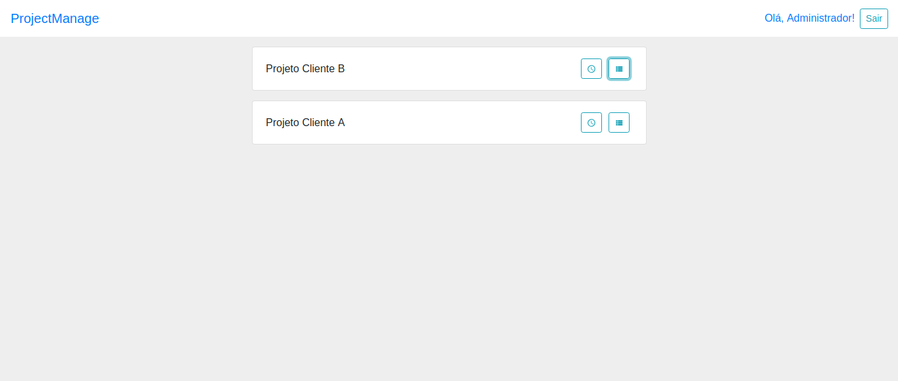

<h1 align="center">
    
</h1>

<h2>:rocket: Tecnologias utilizadas</h2>
<ul>
  <li>React.js</li>
  <li>Redux & Redux Saga</li>
  <li>Hooks</li>
  <li>Reactstrap</li>
  <li>Styled Components</li>
  <li>ESLint + Prettier + EditorConfig</li>
</ul>

<h2>💻 Projeto</h2>

Aplicação web que gerencia a alocação de profissionais em projetos. O objetivo do sistema deve ser controlar as horas trabalhadas do profissional em cada projeto, ou seja, cada profissional deverá ter a possibilidade de registrar quantas horas e em qual projeto trabalhou.

<h2>:question: Instruções para testar o projeto</h2>

Depois de seguir as intruções do [backend](https://github.com/henriSandovalSilva/project-manage-backend).

Execute no terminal:

**1. Baixe as dependências do projeto.** 
`yarn` 

**2. Execute o projeto.** 
`yarn start`

O projeto irá executar em: [http://localhost:3000](http://localhost:3000)

<h2>:computer: Credenciais de acesso: </h2>

**E-mail:** admin@email.com.br 
**Senha:** 123

**E-mail:** programador1@email.com.br 
**Senha:** 123

**E-mail:** programador2@email.com.br 
**Senha:** 123

## :memo: Licença

Esse projeto está sob a licença MIT. Veja o arquivo [LICENSE](LICENSE.md) para mais detalhes.
